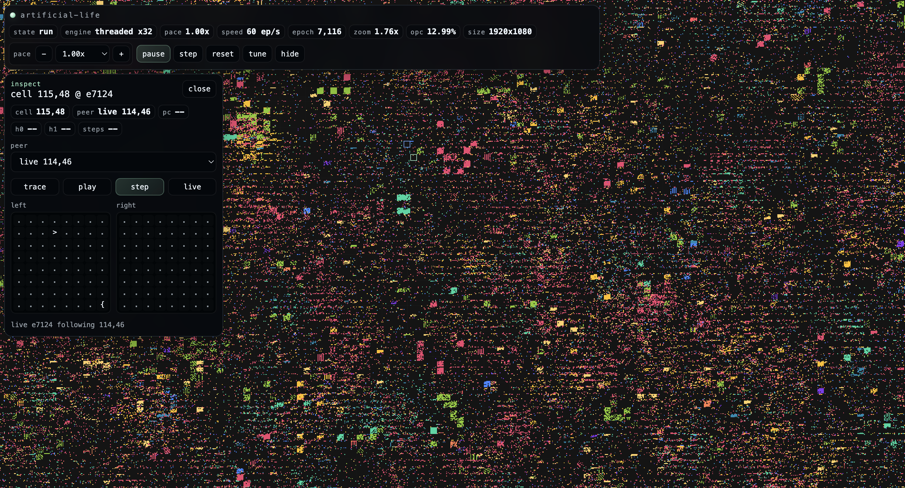

# artificial-life-wasm

Browser-first Rust/WebAssembly implementation of [Computational Life: How Well-formed, Self-replicating Programs Emerge from Simple Interaction](https://arxiv.org/abs/2406.19108).

This repository contains the browser/WebAssembly version of the simulation.

- WebAssembly repo: <https://github.com/Agusx1211/artificial-life-wasm>
- Original repo: <https://github.com/Rabrg/artificial-life>



## What It Does

The simulation runs a `240x135` grid of `64`-byte Brainfuck-like programs. Each epoch:

- programs are paired with a random neighbor from a `5x5` local neighborhood
- each pair is concatenated and executed for up to `8192` interpreter steps
- the pair is split back into two tapes
- background mutation is applied across the grid

The browser app adds:

- threaded WebAssembly on secure contexts
- fullscreen map rendering with pan and zoom
- live cell inspection and pair tracing
- pace controls, seed controls, and grid tuning
- GitHub Pages deployment support

## Local Build

Requirements:

- Rust stable with `wasm32-unknown-unknown`
- Rust nightly `nightly-2025-11-15` with `rust-src`
- `wasm-bindgen-cli 0.2.106`
- `openssl` for local HTTPS certificates

Setup:

```bash
rustup target add wasm32-unknown-unknown
rustup toolchain install nightly-2025-11-15 --component rust-src --target wasm32-unknown-unknown
cargo install wasm-bindgen-cli --version 0.2.106 --locked
```

Build and serve:

```bash
npm run build:web
npm run serve:web
```

Open:

- `https://127.0.0.1:8443/` for threaded local mode
- `https://<your-lan-ip>:8443/` for threaded LAN access after trusting the local certificate
- `http://<your-lan-ip>:8000/` for the single-core fallback

## Controls

- Drag to pan
- Mouse wheel or `+` / `-` to zoom
- `0` to reset the camera
- Click a colony to inspect it
- `[` / `]` to decrease or increase pace
- `h` to hide or show the HUD

## Deploy

GitHub Pages deployment is defined in [`.github/workflows/deploy-pages.yml`](./.github/workflows/deploy-pages.yml).

To build the static Pages artifact locally:

```bash
npm run build:pages
```

That outputs `dist/`. The static bundle includes `coi-serviceworker.js` so Pages can recover cross-origin isolation after the first load and enable threaded WebAssembly on refresh.
